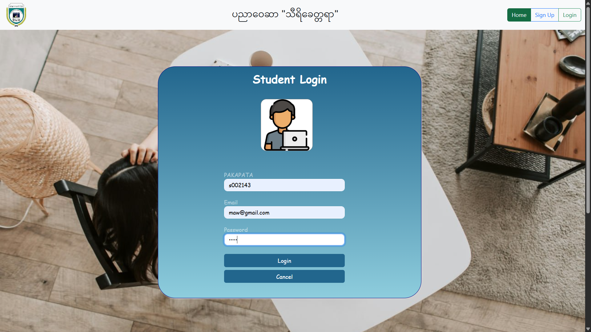
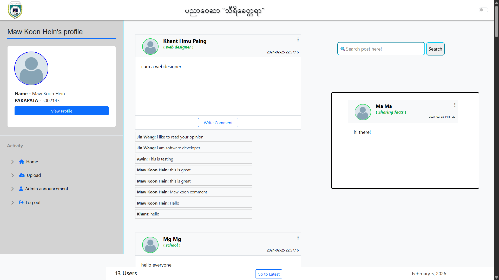
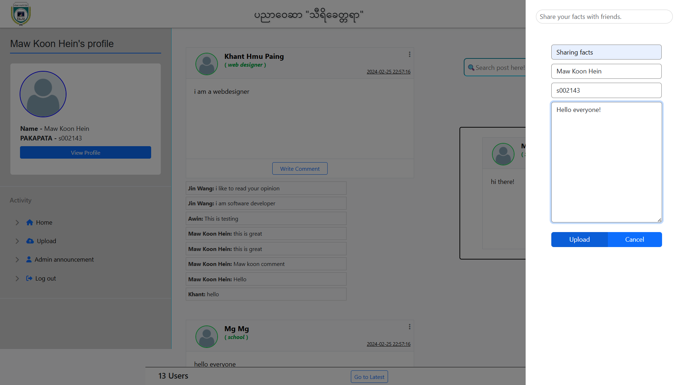

# Student Forum Website (PHP)
- **Description:** A platform for university students to communicate, share news, and manage activities.
- **Technologies:** PHP, MySQL (XAMPP), HTML, CSS, Bootstrap, JavaScript
- **Features:**
  - User registration and login
  - Post updates and comments
  - Event management
- **How to Run:**
  1. Install **XAMPP** or another PHP server.
  2. Copy the project folder into `htdocs`.
  3. Import the database `.sql` file (if included) via **phpMyAdmin**.
  4. Open the project in your browser: `http://localhost/[project-folder]`.

## Screenshots

### Home Page

### Student Signup Page

### Student Login Page

### Student Dashboard Page

### Student Posting Page

### Student Signup Page

### Student Signup Page

### Student Signup Page

### Student Signup Page

### Student Signup Page

  <strong>Thanks for your attention!</strong>

